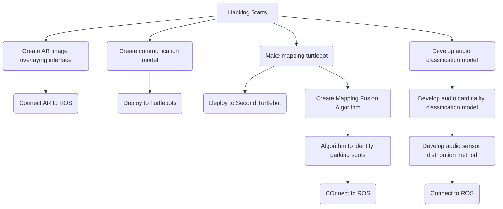
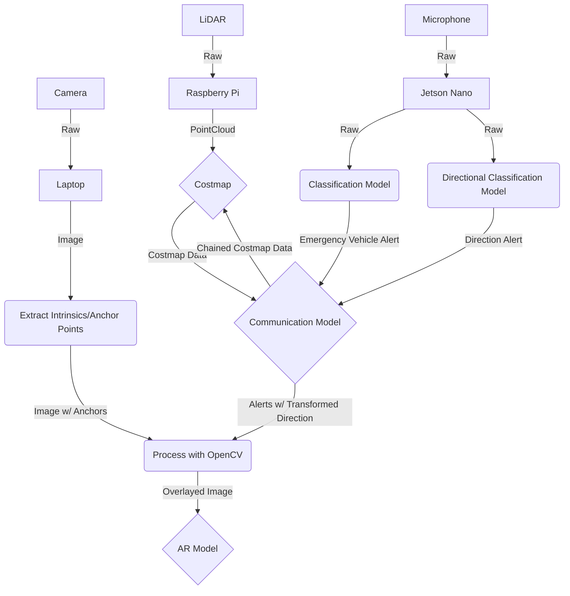

# HackDearborn 2024

## Table of Contents
- [Development Environment](#development-environment)
    - Overview of the software and tools used for development.
- [Parts on hand](#parts-on-hand)
    - List of available hardware components for the project.
- [Parts we need](#parts-we-need)
    - List of additional hardware components required for the project.
- [Purpose](#purpose)
    - Explanation of the project's goals and objectives.
- [A Multi-Modal Reinforcement Learning Approach for Improving Swarm Perception in Connected Vehicles](#a-multi-modal-reinforcement-learning-approach-for-improving-swarm-perception-in-connected-vehicles)
    - Detailed description of the AI approach for enhancing vehicle perception.
- [Using AI and ultrasound for localizing cars](#using-ai-and-ultrasound-for-localizing-cars)
    - Discussion on the use of AI and ultrasound technology for car localization.
- [Basic Plan - ADAS system](#basic-plan---adas-system)
    - Outline of the Advanced Driver Assistance System (ADAS) plan.
- [Plan of Attack](#plan-of-attack)
    - Step-by-step strategy for implementing the project.
- [Data Flow](#data-flow)
    - Diagram and explanation of the data flow within the system.

## Development Environment
- WSL Ubuntu 22.04

## Parts on hand
- 2x Jetson Nano w/ power cables
- 1x Turtlebot, working on getting 2nd
- DC-DC Buck Converters
- Arduinos
- Breadboards
- Wires
- 3x Ubuntu Laptops
- Personal (Windows) Laptops
- Purchasing [microphone](https://www.adafruit.com/product/3421)
- 3x Turtlebot batteries + chargers
- Extension cables
- Monitors
- Cameras (Zed, other webcams)
- Network switch
- Hotspot

## Parts we need
- 1x Jetson Nano (Maybe) w/ power cable
- 1x Turtlebot (Nice to have 2)
- Microphones
- Wiring
- 2x Ubuntu Laptops
- 2x MINIMUM turltebot batteries + chargers
- Extension cables
- Monitors
- Energy Drinks + Cooler + Ice
- Camera
- Network switch
- hotspot
- Environment
    - City Mat courtesy of Rupesh
    - Cardboard / walls
- SNACKS
- Blankets + Pajamas + Toothpaste
- Masking tape
- Controllers

## Purpose
- Creating intelligent, connected vehicles
- Reducing carbon emissions by streamlining the parking process for sustainability
- AI???
- Sound detection to improve accessibility
- Reduce volume in emergency situations

Sharing AI processed sensor data to promote multi-modal swarm perception to improve safety and efficiency on roadways and parking environments.
Using AI to sensor fuse with covariance confidence from cars?

## A Multi-Modal Reinforcement Learning Approach for Improving Swarm Perception in Connected Vehicles
Leveraging artificial intelligence to integrate and analyze data from multiple vehicle sensors, enhancing collective perception and decision-making capabilities across interconnected vehicles. This approach aims to improve safety and optimize traffic flow in both dynamic road environments and static parking scenarios.<br>

The system would utilize AI algorithms to combine sensor inputs, accounting for the varying reliability (covariance confidence) of different data sources from individual vehicles. This collaborative sensing approach enables a more comprehensive and accurate understanding of the surrounding environment, potentially leading to safer and more efficient transportation systems.

## Using AI and ultrasound for localizing cars

## Basic Plan - ADAS system
1. Vehicle to Vehicle Communication
    - Share mapping data across vehicles to create bigger local costmaps
        - Shares Sensor data (lidar and camera)
        - Obstacles (e.g. pedestrians, lampposts)
        - Audio processing for sharing emergency vehicle locations, project to other vehicles?? *Doppler effect localization??????*
        - Alert proximal drivers of presence of emergency vehicle
        - Add cardinality of sound with AI
    - Improved perception for self-driving
2. Vehicle Marshaling (Parking Lots / City Streets?? / Downtown areas)
    - Autonomous/assisted Valet (parking)
    - Augmented Reality
        - Only way to demonstrate is with overlayed image feed with arrows
        ```
        ______________
        |            |
        |     ---->  |
        |     |      |
        |     |      |
        |____________|
        ```
        - Use front camera to display on screen
    - Data comes from shared mapping with other vehicles
    - Have cars request data when people are looking for spots
        - Expensive cars have better sensors so may not need to pull data from other cars
        - No sensor cars could send a request for getting data from parked cars
    - What happens if theres only one car running?
        - Server that stores map data (If we have time)
            - Vehicle to Infrastructure??
            - Internal fixed Map
            - Not sharing the map with vehicles reduces server cost
            - Store occupied spots
            - Give location of open spots
            - TCD alert # spots open
        - Cars could send out data while off
    - AI Model for parking spot identification??
    - AI Sensor Anamoly Detection??
3. Add AI to vehicle costmap fusion? Optimization algorithm for DH parameters for better mapping.
    - x 
## Plan of Attack


## Data Flow
